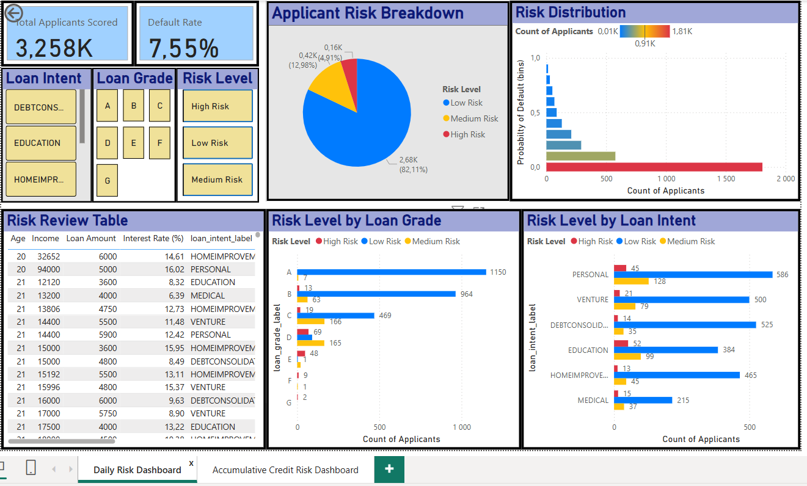
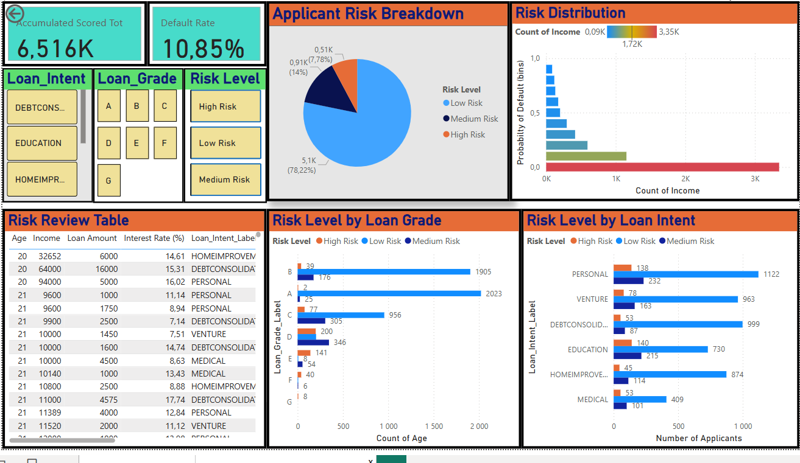

# Automated Credit Risk Scoring Pipeline


This project simulates a real-world automated credit risk scoring system for financial services. It ingests applicant data, applies standardised transformations, scores applicants using a logistic regression model, and maintains a cumulative scoring history to support both operational monitoring and long-term risk analysis. Results are visualised through interactive Power BI dashboards.


## Project Overview

This Python-based end-to-end data pipeline:

* Automatically detects and processes new credit applicant files.
* Cleans and encodes raw input data.
* Scores applicants using a trained logistic regression model.
* Appends results to a cumulative historical dataset.
* Powers two Power BI dashboards: one for recent daily insights, another for long-term risk trends.

---

## Pipeline Structure

```
data/
├── incoming/             Raw credit files dropped here
├── processed/            Files moved here after being processed
├── saved_data.csv        Latest scored batch only
├── scored_history.csv    Cumulative scoring history

scripts/
├── ingest.py             Detects and loads latest unprocessed file
├── transform.py          Cleans and encodes raw data
├── score.py              Loads the model and scores data
├── train_model.py        Trains logistic regression model
└── main.py               Orchestrates the full pipeline logic
```

---

## Features

* **Automated Ingestion**
  Monitors the incoming folder and processes only new files using file hash detection to avoid duplicates.

* **ETL and Scoring**
  Applies consistent transformations to the data before scoring with a trained logistic regression model.

* **Persistent Output**
  Stores the most recent batch in `saved_data.csv` and appends each batch to `scored_history.csv` for trend analysis.

* **Upload Tracking**
  Adds an `upload_date` field to track scoring over time.

* **Power BI Dashboards**

  * One dashboard for daily insights using `saved_data.csv`
  * One for cumulative patterns and trends using `scored_history.csv`

---

## Machine Learning

* **Model**: Logistic Regression
* **Training Size**: 30,000 records
* **Target Variable**: `loan_status`
* **Output Columns**:

  * `predicted_default` (0 or 1)
  * `default_probability` (probability of default)

## Model and Risk Rationale

A logistic regression model was selected due to its:
- Interpretability and transparency
- Alignment with regulatory expectations in credit risk modelling
- Ability to produce stable probability-based risk scores

### Model Performance
- **ROC-AUC:** 91.54%
- **Accuracy:** 89.87%

The model outputs a probability of default-style risk score, which can be thresholded or monitored over time depending on business risk appetite.


## Simulation and Automation

* Data uploads were simulated by splitting the original dataset and manually placing batches in the incoming folder.
* The pipeline was designed to run daily, simulating a real-world scenario where new applicant files are received regularly.
* During development, Windows Task Scheduler was used to test automation at regular intervals.

---

## Dashboards

Built in Power BI to support credit risk decision-making:

* Daily dashboard: Visualises only the latest batch of applicants.
* Cumulative dashboard: Tracks overall trends and changes over time.
* Includes filters for loan intent, risk level, credit history length, and more.

---

## Tools and Technologies

* **Languages**: Python, SQL
* **Libraries**: pandas, NumPy, scikit-learn, joblib, matplotlib
* **Workflow**: Hash-based file tracking, ETL, file movement
* **Storage**: CSV files (latest and historical)
* **Visualisation**: Power BI
* **Version Control**: Git and GitHub

---

## Folder Setup

Ensure the following folder structure exists before running the pipeline:

```
/data/incoming
/data/processed
/models/
```

Drop a `.csv` file into `data/incoming` to simulate a new data upload.

---

## How to Run

To run the pipeline manually:

```bash
python scripts/main.py
```

You can also configure it to run automatically on a schedule (e.g. daily) using a task scheduler.

---
## Dashboard Screenshots

### Daily 
.

## Cummulative


## Author

**Mussa Phiri**
MSc Computer Science | Data Science | Machine Learning | Risk Analytics
